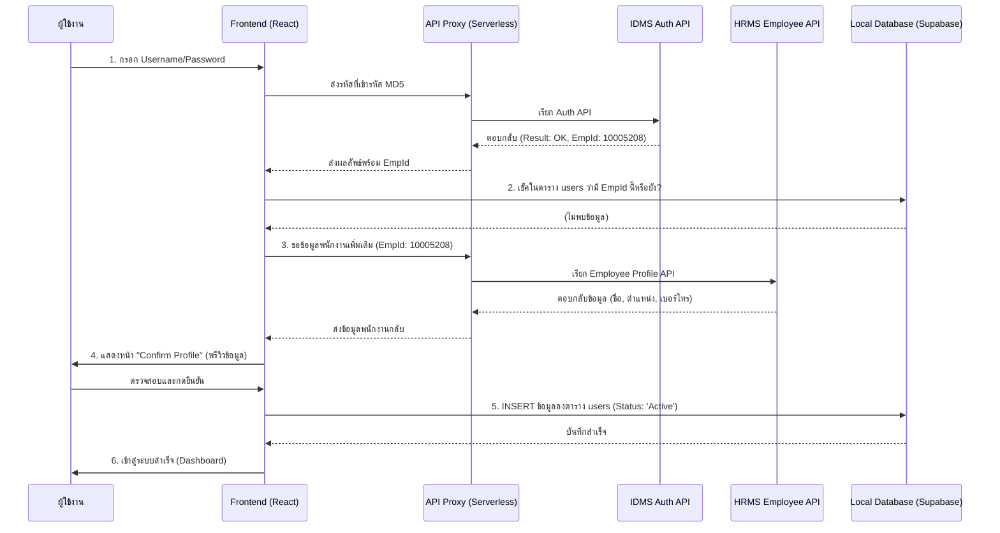

# Analysis of HRMS Login Integration Structure

เอกสารฉบับนี้วิเคราะห์โครงสร้างระบบ Login ที่เชื่อมต่อกับ HRMS (IDMS) ของ Advance Agro เพื่อนำไปประยุกต์ใช้กับโปรเจคใหม่ โดยเน้นที่การยืนยันตัวตนผ่านส่วนกลางและการจัดการฐานข้อมูลภายในแบบ Auto-Provisioning

## 1. การเชื่อมต่อ Endpoint (IDMS Authentication)

ระบบใช้ Endpoint ของ IDMS ในการเช็คสิทธิ์ผู้ใช้งาน โดยมีรายละเอียดดังนี้:

- **URL:** `https://mobiledev.advanceagro.net/ws/api/idms/authentication/`
- **Method:** `GET`
- **Parameters:**
  - `account`: ชื่อผู้ใช้งาน HRMS (Username)
  - `password`: รหัสผ่านที่ผ่านการเข้ารหัส **MD5**
  - `Service`: `0000` (ค่าคงที่)
  - `AgentId`: `SystemMango` (ค่าคงที่สำหรับแอปพลิเคชันนี้)
  - `AgentCode`: `Np4kfRh5` (รหัสยืนยันตัวตนของแอปพลิเคชัน)

### ตัวอย่างการประกอบ URL:
```text
https://mobiledev.advanceagro.net/ws/api/idms/authentication/?account=USER_NAME&password=MD5_PASSWORD&Service=0000&AgentId=SystemMango&AgentCode=Np4kfRh5
```

## 2. การเข้ารหัส (MD5 Encryption)

รหัสผ่านที่ส่งไปยัง IDMS **ต้อง** ถูกแปลงเป็น MD5 Hash ก่อนเสมอ 
- ใช้ Library: `js-md5` หรือ `crypto-js`
- ตัวอย่างโค้ด: `const hashedPassword = md5(rawPassword);`

## 3. การดึงข้อมูลรายละเอียดพนักงาน (Employee Profile)

หลังจากที่ Login สำเร็จและได้รับ `EmpId` มาแล้ว หากในฐานข้อมูลยังไม่มีข้อมูลพนักงานคนนี้ ระบบควรไปดึงข้อมูลรายละเอียดเพิ่มเติมเพื่อนำมาบันทึก (หรือให้ผู้ใช้ตรวจสอบก่อนกดยืนยัน) โดยใช้ Endpoint ดังนี้:

- **URL:** `https://api-idms.advanceagro.net/hrms/employee/[EmpId]`
- **Method:** `GET`

### ตัวอย่าง JSON ที่ได้รับ:
```json
{
  "status": "success",
  "message": "ok",
  "data": {
    "employee": {
      "ID_Emp": "10005208",
      "EmpName": "ชัชวาลย์ ตุลาผล",
      "CompanyName": "บริษัท ไอพี 5 จำกัด",
      "Department": "Improvement",
      "Position": "Operation Process Improvement Section Manager",
      "EMail": "chatchawan_tu@mibholding.com",
      "Sim_Number": "0858353379"
    }
  }
}
```

### การ Mapping ข้อมูลลง Database:
| API Field | Database Field | คำอธิบาย |
| :--- | :--- | :--- |
| `ID_Emp` | `emp_id` | รหัสพนักงาน |
| `EmpName` | `full_name` | ชื่อ-นามสกุล |
| `EMail` | `email` | อีเมลพนักงาน |
| `Sim_Number` | `phone` | เบอร์โทรศัพท์ |
| `Position` | `position` | ตำแหน่งงาน |
| `Department` | `department` | แผนก/ฝ่าย |

---

## 4. Workflow สำหรับโปรเจคใหม่ (Login + Auto Profile Fetch)

ระบบจะทำงานร่วมกันระหว่าง API 2 ตัว เพื่อให้ผู้ใช้งานไม่ต้องกรอกข้อมูลเองทั้งหมด:



## 5. คำแนะนำเพิ่มเติม (Best Practices)

1.  **CORS Proxy:** ทั้ง API Auth และ API Employee ควรอ้างอิงผ่าน Proxy Server เดียวกันเพื่อความปลอดภัยและจัดการ Headers ได้ง่าย
2.  **Complete Profile Page:** ในขั้นตอนที่ 4 ควรทำ UI ให้ผู้ใช้สามารถแก้ไขข้อมูลบางส่วนได้ (เช่น เบอร์โทร หรือ Email) หากข้อมูลจาก HRMS ไม่อัปเดต ก่อนที่จะบันทึกจริงลงฐานข้อมูล
3.  **Caching:** ข้อมูลพนักงานจาก HRMS มักไม่เปลี่ยนบ่อย สามารถเก็บ Cache ไว้ชั่วคราวได้ในขณะที่รอดำเนินการ Login
4.  **Error Handling:** หาก API ตัวที่สองขัดข้อง (ดึง Profile ไม่ได้) ควรมีแผนสำรองให้ผู้ใช้กรอกข้อมูลด้วยตนเอง (Manual Entry) เพื่อไม่ให้ขัดจังหวะการเข้าใช้งานครั้งแรก

---
*จัดทำโดย Antigravity AI เพื่อเป็นแนวทางในการพัฒนาระบบ Login ใหม่*
